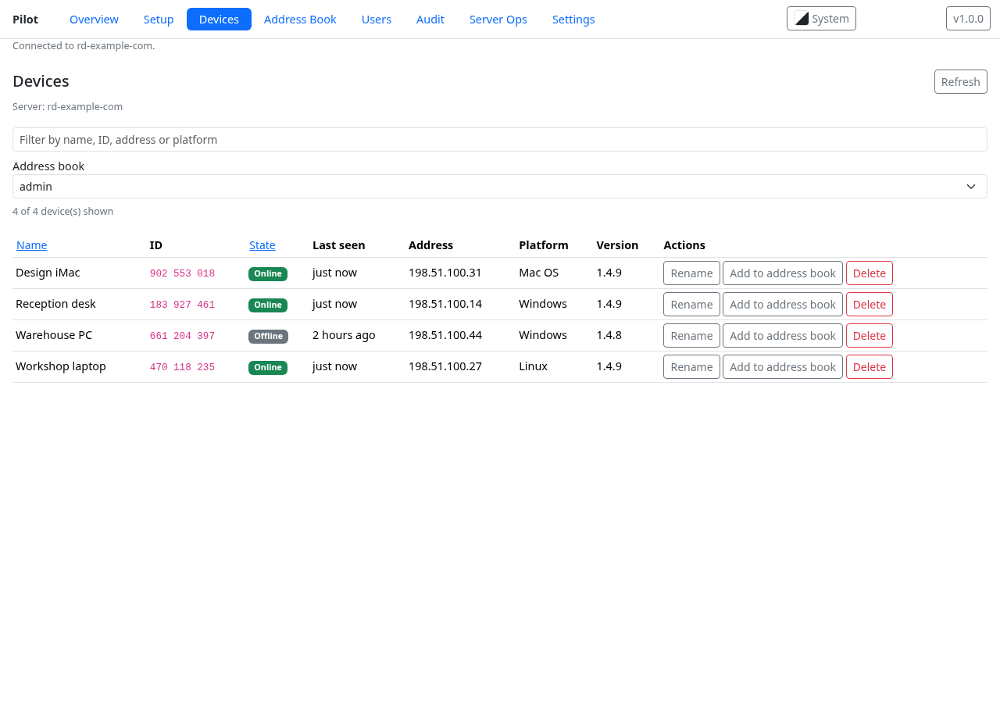
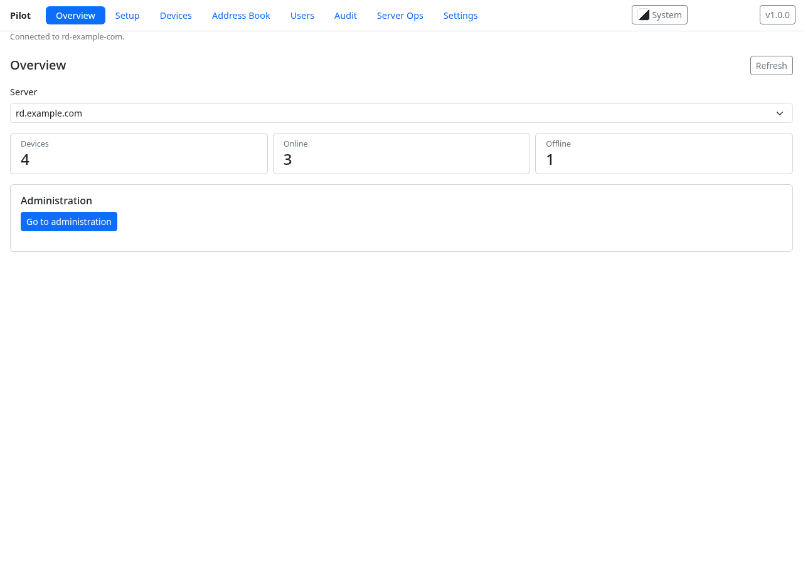
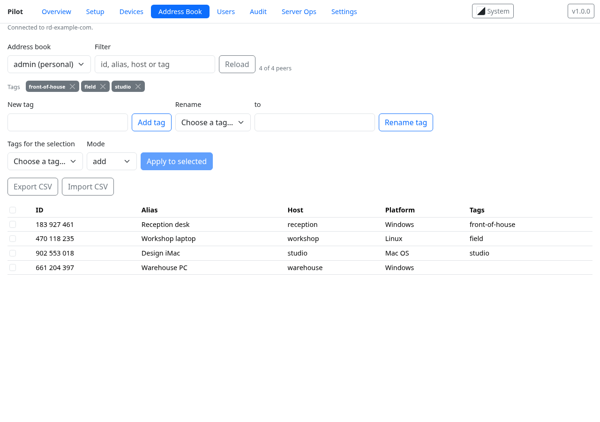
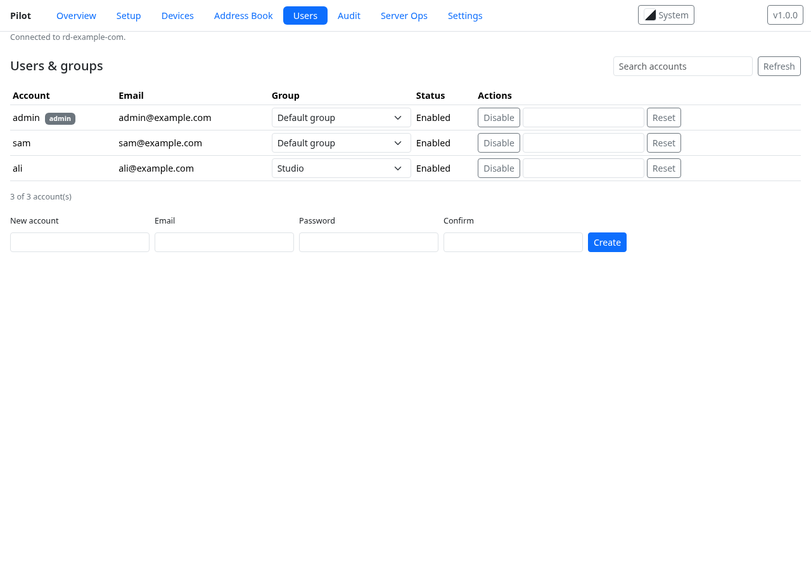
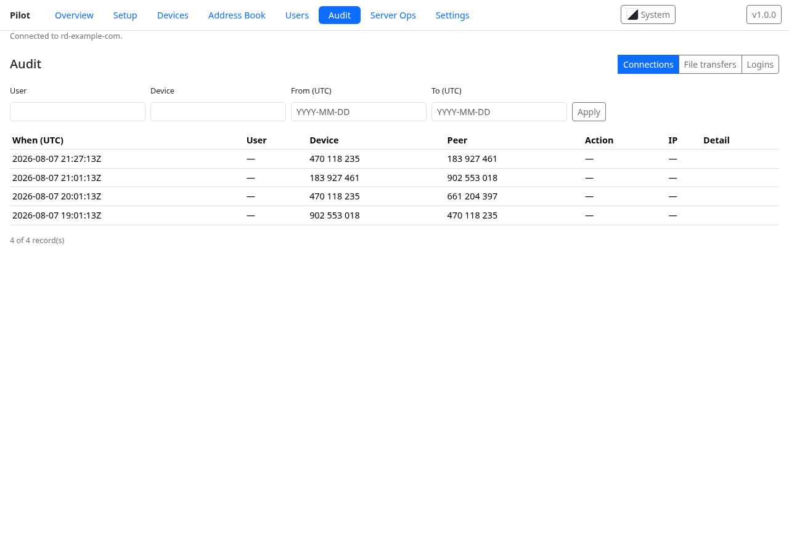
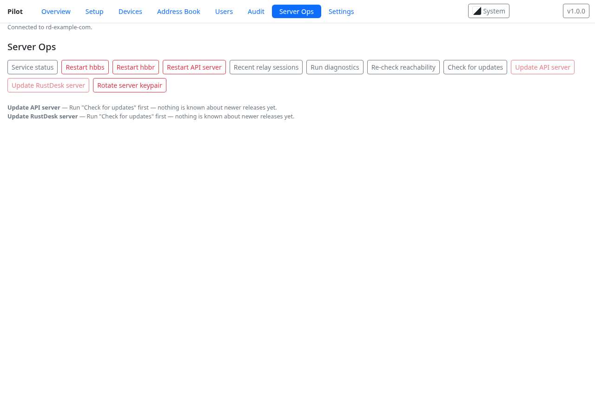
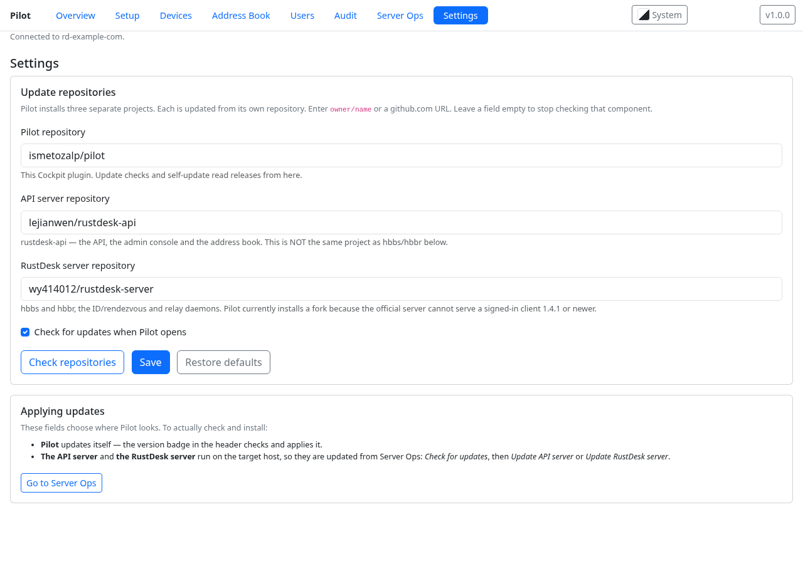
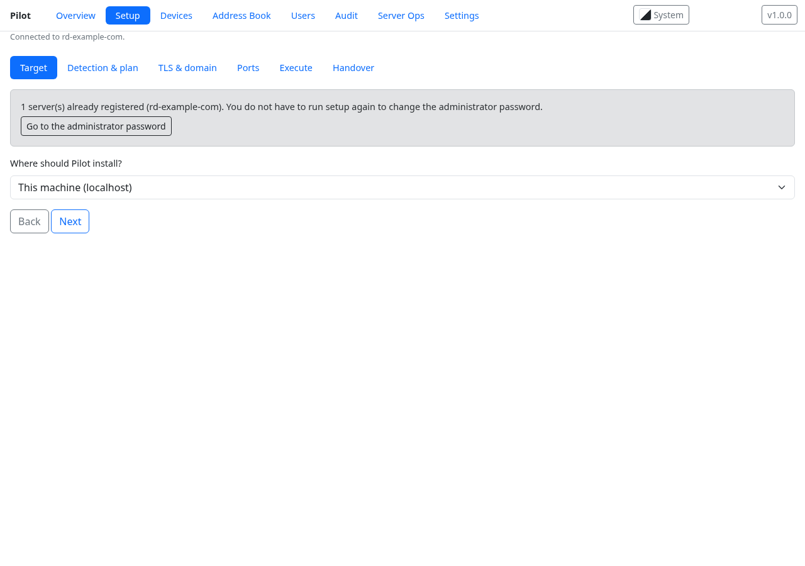

# Pilot

A [Cockpit](https://cockpit-project.org/) plugin that installs and then manages a
self-hosted [RustDesk](https://rustdesk.com/) server: the OSS `hbbs`/`hbbr` pair plus
the [`lejianwen/rustdesk-api`](https://github.com/lejianwen/rustdesk-api) API server
that gives them a control plane.

> **`hbbs`/`hbbr` currently come from a fork, on purpose.** Pilot installs
> [`wy414012/rustdesk-server`](https://github.com/wy414012/rustdesk-server) **1.4.3**
> rather than the official `rustdesk/rustdesk-server`. See
> [Why the server is a fork](#why-the-server-is-a-fork) — this is temporary and
> Pilot moves back to the official repo as soon as upstream is fixed.



Two jobs, one screen:

* **Provisioning.** A wizard that detects the target, shows you the exact plan it
  intends to run, runs it with a live transcript, and hands over a working console —
  on this machine or on a remote host over SSH. Every step is also available as a
  shell script you can read and run yourself.
* **Day-2 management.** Devices, address books, users and groups, audit logs, service
  status and restarts, key rotation, and updates: Pilot updates itself from GitHub
  releases, and Server Ops updates the API server and the RustDesk server on the
  target after checking what is actually installed there.

## What it needs

| | |
|---|---|
| Cockpit | 300 or newer (`manifest.json` declares `requires.cockpit: "300"`) |
| The Cockpit host | `python3` for the privileged helper; `ssh`, and `sshpass` only for password-authenticated SSH targets |
| The target | systemd, and outbound internet access for the pinned downloads. `curl`, `unzip` and `tar` are used by the plan |
| Privilege | The wizard asks Cockpit for administrative access; nothing runs as root until you grant it |

TLS is optional and offered in three tiers: your own domain, an automatic
`sslip.io` hostname, or DuckDNS. Choosing one installs and configures Caddy on 443,
which is what makes the API reachable over `https://` and the admin console
linkable from Overview. Skipping it is a supported choice — Overview then says
exactly why the console cannot be opened, and offers the route to set TLS up.

## Why the browser web client is disabled

Pilot provisions `rustdesk-api` with `app.web-client: 0`, so `/webclient/` is not
served. This is deliberate.

The web client bundled with `rustdesk-api` v2.7 **cannot reach a self-hosted
rendezvous server**. Its startup path latency-probes a hardcoded list —
`rs-sg`, `rs-cn`, `rs-us.rustdesk.com` — and overwrites the stored rendezvous
server with whichever answers. On a self-hosted deployment those hosts are
unreachable, so it fails with *"Failed to connect to rendezvous server"* before
anything else runs.

That was verified against a real server every way the client can be configured:
the API-injected config, `custom-rendezvous-server` and `rendezvous-server` in
localStorage, with and without the `:21116` port, the server key set, signed in
and signed out, before and after a reload, and by opening a session URL
directly. **No socket ever reached the self-hosted server.**

Serving it anyway would publish a page that cannot work and needs no login to
reach. Disabling it touches nothing else: the admin console at `/_admin/` and
the whole `/api` surface are separate routes and stay up — Pilot's Overview links
to the admin console.

To re-enable it on a server, set `app.web-client: 1` in
`/opt/rustdesk-api/conf/config.yaml` and restart `rustdesk-api`. Expect the
failure above.

## Why the server is a fork

Pilot provisions `hbbs`/`hbbr` from
[`wy414012/rustdesk-server`](https://github.com/wy414012/rustdesk-server) **1.4.3**,
not from the official `rustdesk/rustdesk-server`. **This is temporary.**

**The reason.** A RustDesk client 1.4.1 or newer that is *signed in* to the API
server cannot connect through official `hbbs` **1.1.16** — the newest official
release. The same client, signed out, connects fine. Because Pilot exists to manage
the address book, and the address book only exists when you are signed in, the
official server cannot run a working Pilot deployment today. Measured on a live
1.4.9 client against both servers: signed out it connects, signed in every attempt
fails, and swapping only the server binaries fixes it.

The failure is easy to misread. It surfaces on the client as
`Failed to secure tcp: deadline has elapsed`, which sounds like a firewall, a
certificate or a wrong key, and is none of those.

**What the fork changes.** Nothing about how Pilot installs it. The fork tracks the
*client* version line (1.4.x) instead of the 1.1.x server line, ships the same asset
names, the same three binaries (`hbbs`, `hbbr`, `rustdesk-utils`) in the same flat
layout, and uses the same systemd units and data directory. Only the download origin,
version and digests differ, all pinned in `js/core/ostarget.js` and checked by
SHA256 before anything is unpacked.

**Moving back to the official repo.** Watch
[rustdesk-server releases](https://github.com/rustdesk/rustdesk-server/releases) for
a release above 1.1.16 that serves signed-in 1.4.x clients, and
[lejianwen/rustdesk-api#482](https://github.com/lejianwen/rustdesk-api/issues/482)
for the upstream discussion. To switch back, in `js/core/ostarget.js` set
`SERVER_UPSTREAM` to `rustdesk/rustdesk-server`, `SERVER_IS_FORK` to `false`, and
`SERVER_VERSION` plus every `SERVER_ASSETS` digest to the new release. The tests in
`tests/unit/ostarget.test.js` pin all of those together, so a half-applied switch
fails rather than shipping a mixed origin.

Already-provisioned servers are upgraded in place with the distribution packages or
the release zip; the `id_ed25519` keypair in `/var/lib/rustdesk-server` is untouched
by the swap, so no client needs reconfiguring in either direction.

## What it looks like

Every image below is generated from `tests/screenshots.mjs`, which drives the same
stubbed harness the end-to-end tests use. The data is fictional — RFC 2606
hostnames, RFC 5737 addresses, invented device ids — so no screenshot can leak a
real deployment. Regenerate them with `node tests/screenshots.mjs`.

| | |
|---|---|
| **Overview** — the active server, device counts, and the route to the admin console | **Devices** — inventory with real online state, rename, delete, add to a book |
|  |  |
| **Address Book** — books, tags, bulk tagging, CSV import and export | **Users** — accounts and groups as the API reports them |
|  |  |
| **Audit** — connection, file-transfer and login logs with filters | **Server Ops** — status, restarts, diagnostics, updates, key rotation |
|  |  |
| **Settings** — the update repository for each of the three components | **Setup** — the provisioning wizard, plan shown before anything runs |
|  |  |

## Install

```sh
sudo make install          # /usr/share/cockpit/pilot + /usr/libexec/pilot
sudo systemctl try-restart cockpit
```

For development, with no root at all, use Cockpit's per-user search path:

```sh
ln -s "$(pwd)" ~/.local/share/cockpit/pilot
```

Third-party bundles (Alpine, Bootstrap) are not committed. Fetch them once:

```sh
make vendor
```

Other targets: `make zip` builds `pilot-<VERSION>.zip` with a single top-level
`pilot/` directory, `make publish` uploads it as GitHub release `v<VERSION>`, and
`make uninstall` removes the plugin but leaves `/etc/pilot` alone.

## How it is built

No build step, no bundler, no ES modules. Every file under `js/` is an IIFE that
assigns a `Pilot*` global and dual-exports under CommonJS, so the same file runs in
the browser as a plain `<script>` and under `node --test` with no DOM.

```
js/core/       pure logic: no cockpit, no DOM, no I/O (three I/O exceptions:
               api-io.js, servers.js, settings.js)
js/features/   one Alpine component per surface
libexec/       pilot-exec, the privileged Python helper that executes a plan
```

The content security policy is `default-src 'self'; connect-src 'self'`, so the
page cannot `fetch()` a remote host at all. Every request to the RustDesk API goes
through the Cockpit bridge (`cockpit.http`, which appears in exactly one file), and
the self-update goes through `cockpit.spawn(curl)`.

Secrets never travel in an argv — `/proc/<pid>/cmdline` is world-readable. SSH
passwords reach `sshpass` over a pipe, the DuckDNS token reaches `curl` through a
0600 root-only config file, and stored credentials live in 0600 sidecar files
beside the server record, never inside it.

## Tests

Five tiers, all runnable from a checkout:

```sh
npm test                 # ~1650 unit tests (node:test), no browser, ~2s
npm run test:integration # pilot-exec against real podman containers, ~30s
npm run test:smoke       # 8 structural rules (C7 order, dual exports, CSP, …)
npm run test:e2e         # Playwright against index.html + a stubbed bridge
npm run test:live        # Playwright against a REAL Cockpit on localhost:9090
```

`tests/screenshots.mjs` is not a test — it reuses the same harness to regenerate
the images in this README from fictional data (`node tests/screenshots.mjs`).

`test:e2e` needs `make vendor` to have run and skips cleanly with a printed reason
if chromium is unavailable (`PILOT_E2E_REQUIRE=1` turns that skip into a failure).
`test:live` is opt-in: it needs Pilot installed, Cockpit listening on 9090, and
credentials in `COCKPIT_USER`/`COCKPIT_PASSWORD`. It asserts state only — it never
installs anything, never runs `sudo`, and restores your
`~/.config/cockpit/pilot/settings.json` when it is done.

## Configuration

| Path | What |
|---|---|
| `/etc/pilot/config.json` | which server is active |
| `/etc/pilot/servers/<id>.json` | one record per managed server — never a secret |
| `/etc/pilot/servers/<id>.{ssh,token}` | 0600 root-only credential sidecars |
| `/var/lib/pilot/runs/<run-id>.jsonl` | the transcript of each provisioning run |
| `~/.config/cockpit/pilot/settings.json` | per-user settings: theme, and the update repository for each of Pilot, the API server and the RustDesk server |

## Licence

See the [`LICENSE`](LICENSE) file at the root of this repository — that file is
the authority, and GitHub shows the same terms in the sidebar.

Third-party components keep their own licences and are not covered by it: Alpine
and Bootstrap are fetched by `make vendor` rather than committed, and Pilot
installs `hbbs`/`hbbr` and `rustdesk-api` from their upstream releases at
provision time rather than redistributing them.
